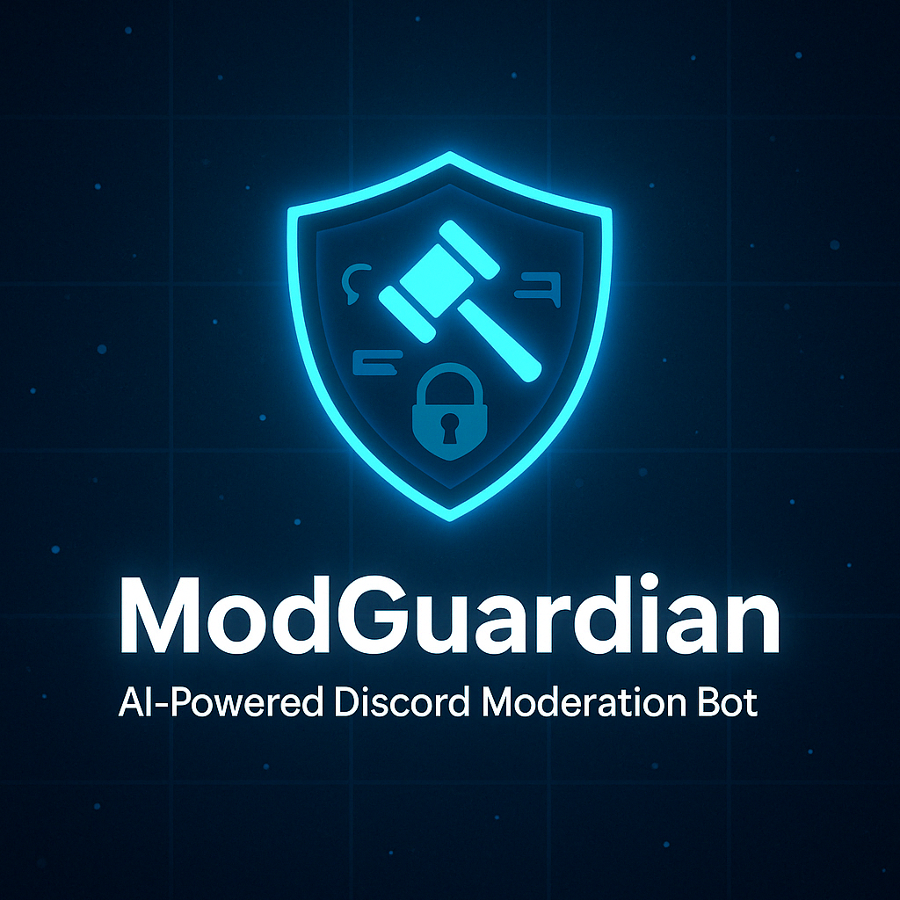

# 🛡️ ModGuardian

**ModGuardian** is an AI-powered Discord moderation bot designed to help server admins maintain a clean, spam-free, and well-managed community.
Built with Python, `discord.py`, and real-time filters, it includes automatic bad word filtering, logging, mute/ban commands, and more.



---

## ✨ Features

- 🚫 **Bad Word Filter** – Auto-deletes messages containing offensive words (customizable)
- 🗣️ **Anti-Spam** – Detects repeated messages to prevent spam
- 🔇 **Mute/Unmute** – Temporarily mute members with timed unmute
- 👢 **Kick & Ban** – Commands for kicking and banning members
- 📝 **Event Logger** – Logs message deletes and edits to a dedicated channel
- 👋 **Welcome/Leave Messages** – Greets users when they join or leave
- 🔐 **Role-Based Permissions** – Only trusted roles can use mod tools
- 💬 **Command Prefix Customization** via `.env` or `settings.py`

---

## 🚀 Getting Started

### 1. Clone the repository

```bash
git clone https://github.com/your-username/modguardian.git
cd modguardian
```

### 2. Create and configure `.env` or `settings.py`

```
BOT_TOKEN=your-discord-bot-token
COMMAND_PREFIX=!
LOG_CHANNEL_ID=123456789012345678
MUTE_ROLE_NAME=Muted
GUILD_ID=123456789012345678
```

Or alternatively, use `settings.py`:

```
BOT_TOKEN = "your-discord-bot-token"
COMMAND_PREFIX = "!"
LOG_CHANNEL_ID = 123456789012345678
MUTE_ROLE_NAME = "Muted"
GUILD_ID = 123456789012345678
```

### 3. Install dependencies

```
pip install -r requirements.txt
```

### 4. Run the bot

```
python bot.py
```

---

## 📁 Project Structure

```
modguardian/
├── bot.py                 # Main bot launcher
├── settings.py            # Config file (or use .env)
├── requirements.txt
├── data/
│   └── bad_words.json     # List of filtered words
├── cogs/
│   ├── moderation.py      # Kick, ban, mute, unmute
│   ├── filters.py         # Profanity + anti-spam
│   ├── events.py          # Joins, leaves, errors
│   └── logger.py          # Message delete/edit logging
├── utils/
│   ├── bad_word_loader.py
│   └── time_utils.py
└── assets/
    └── banner.png         # Bot banner/logo
```


---

## ✅ Permissions Checklist


Before inviting the bot, ensure these permissions are granted:

* [X] `Send Messages`
* [X] `Manage Messages`
* [X] `Manage Roles`
* [X] `Kick Members`
* [X] `Ban Members`
* [X] `Read Message History`
* [X] `Embed Links`

### ✅ Enable These in Discord Developer Portal:

* ✅ **SERVER MEMBERS INTENT**
* ✅ **MESSAGE CONTENT INTENT**
* ✅ **Presence Intent**


---


## 🧠 Customization

* Add/remove words in `data/bad_words.json`
* Modify filter behavior in `filters.py`
* Customize duration logic in `time_utils.py`

---


## 🛠 Tech Stack

* Python 3.10+
* [discord.py](https://github.com/Rapptz/discord.py)
* dotenv or settings-based config
* Async/Await architecture


---


## 📜 License

This project is licensed under the APACHE License.

Feel free to fork, extend, and deploy your own version!

---


## 🤝 Contributing

Pull requests and issues are welcome!

If you'd like to contribute features, translations, or ideas, just open an issue or fork the repo.

---


## 👑 Created By

Made with ❤️ by Youssef Osama
